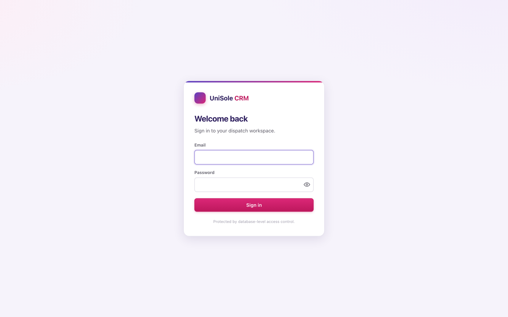
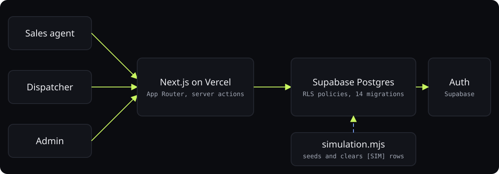

<div align="center">



# Freightly

**Dispatch CRM for a truck-dispatching company: sales pipeline, carriers, loads, and team targets in one place.**

<p>
<a href="https://unisole-crm.vercel.app"></a>
<a href="https://ibiraheel.com/p/freightly"></a>
</p>

<p>


</p>

</div>

<br>

> **Spreadsheets to a live CRM**  
> for UniSole IT Hub, a truck-dispatch business with sales agents and dispatchers

## What it did

Working MVP with auth, carriers, loads, dashboards, team targets, and row-level security, running on Supabase and deployed on Vercel.

<sub>Outcome: reported by the owner.</sub>

## How it works

<p align="center"></p>

1. Next.js App Router with server actions; no separate API service to run.
2. Supabase Postgres with row-level security so agents and dispatchers only see their own book.
3. Fourteen ordered SQL migrations plus a simulation script that seeds and clears [SIM] demo rows.
4. Product defined first: PRD, design doc, and roadmap live in the repo and drove the build.

## Run it locally

```bash
cp .env.local.example .env.local   # Supabase URL + anon key (+ service role for admin logins)
# apply the schema: paste supabase/apply_all.sql into the Supabase SQL editor
npm install
npm run dev                          # http://localhost:3000
```

## Repository layout

```
├── app/
│   ├── (app)/
│   ├── api/
│   ├── login/
│   ├── globals.css
│   ├── layout.tsx
│   └── page.tsx
├── components/
│   ├── AgentAssigner.tsx
│   ├── CarrierFilters.tsx
│   ├── CarrierForm.tsx
│   ├── DispatcherAssigner.tsx
│   ├── DispatchNoteModal.tsx
│   ├── EditCarrierForm.tsx
│   ├── FollowUpModal.tsx
│   ├── icons.tsx
│   ├── LeadImportForm.tsx
│   ├── LifecycleStrip.tsx
│   ├── LoadAmountEditor.tsx
│   ├── LoadFilters.tsx
│   ├── LoadForm.tsx
│   └── LoadsFlowMap.tsx
│   └── … 14 more
├── lib/
│   ├── actions/
│   ├── supabase/
│   ├── auth.ts
│   ├── presence.ts
│   ├── status.ts
│   └── usStates.ts
├── supabase/
│   ├── migrations/
│   ├── apply_all.sql
│   ├── README.md
│   └── seed.sql
├── CLAUDE.md
├── middleware.ts
├── next.config.mjs
├── package.json
├── ROADMAP.md
├── simulation.mjs
├── tsconfig.json
├── UniSole_CRM_Design.md
├── UniSole_CRM_PRD.md
└── vercel.json
```

---

<div align="center">

<sub>Built by <a href="https://github.com/ibi-raheel">Muhammad Ibrahim Raheel</a> · more work at <a href="https://ibiraheel.com">ibiraheel.com</a></sub>

</div>
